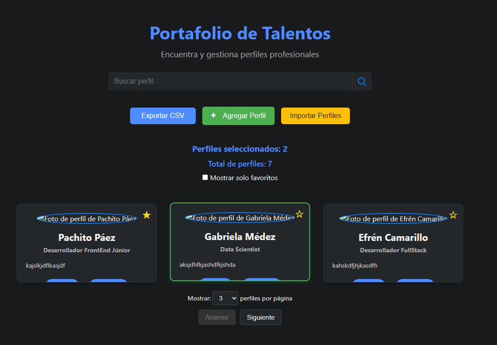

# Portafolio de Talentos

Una aplicación web interactiva para gestionar, buscar y filtrar perfiles profesionales. Permite agregar, editar, eliminar, seleccionar, marcar como favorito, importar/exportar y visualizar detalles de cada perfil, todo con una experiencia moderna y adaptable a modo oscuro/claro.

---

## 🚀 Características principales

- **Búsqueda instantánea** por nombre, título u ocupación.
- **Filtrado de favoritos** y contador de perfiles seleccionados.
- **Paginación** configurable.
- **Agregar, editar y eliminar perfiles** con confirmación.
- **Importar y exportar perfiles** en formato CSV o JSON.
- **Modo oscuro/claro** con persistencia.
- **Vista de detalles** en modal para cada perfil.
- **Notificaciones (toasts)** para acciones importantes.
- **Animaciones suaves** y diseño responsive.

---

## 🖼️ Captura de pantalla



---

## ⚙️ Instalación y uso

1. **Clona el repositorio:**
   ```bash
   git clone git@github.com:Nerfe5/tarjetasPerfilesInteractivos.git
   cd tarjetasPerfilesInteractivos
   ```

2. **Abre el archivo `index.html` en tu navegador.**
   - No requiere backend ni instalación adicional.

---

## 📦 Estructura del proyecto

- `index.html` — Estructura principal de la app.
- `styles.css` — Estilos y temas (oscuro/claro).
- `script.js` — Lógica de la aplicación.
- `README.md` — Este archivo.

---

## ✨ Próximas mejoras

- Filtros avanzados por campos personalizados.
- Soporte para imágenes locales.
- Integración con APIs externas.
- Accesibilidad mejorada (teclado y ARIA).
- Adaptación para gestión de equipos electrónicos (Biomedi-Go).

---

## 📝 Licencia

MIT

---

## 🙌 Autor

Desarrollado por [Nerfe5](https://github.com/Nerfe5) con ayuda de GitHub Copilot.

---

¡Contribuciones y sugerencias son bienvenidas!